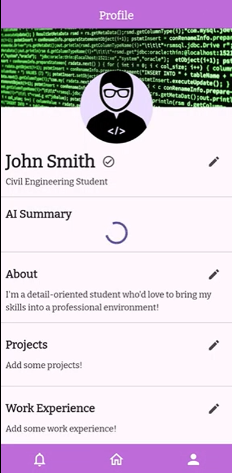
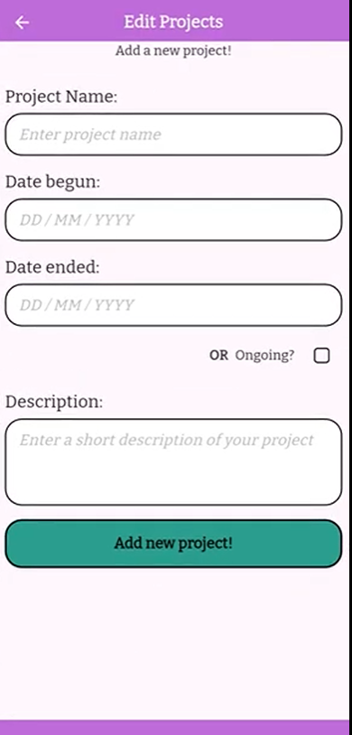
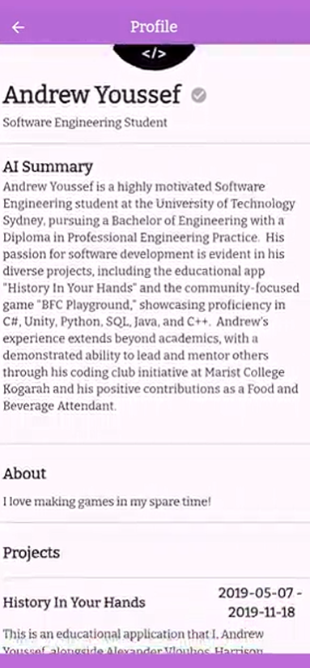

# Project Title: Thrive X

## Client: Innate X

## Description:
 Thrive X is a mobile portfolio app designed to help students showcase their skills, experiences, and personal stories to potential employers, coaches, and recruiters. Built using Flutter and Firebase, the app allows users to create dynamic, professional profiles with sections like Projects, Work Experience, Certificates, and more. An integrated AI feature, powered by Google Gemini, generates tailored summaries to enhance profile presentation. The app was developed using Agile methodology, with a focus on student users and real-time data syncing through Firestore. Thrive X aims to bridge the gap between education and employment through modern, narrative-driven digital portfolios.

## Individual Contribution
- Program Logic
- Database communicaitons
- UI development
- Profile external/internal view
- Themes
- State Management

## Demonstration
### Profile Screen

### Real-time Profile Editing

### Search Funcionality With Filtering

### External Profile View

## Team:

- Xiang Hong Ong | 14352595
- Adrian Rolfo | 24818686
- Andrew Youssef | 24500530
- Alexander Vlouhos | 24507612
- Wilson Dao | 24764363

To run:
    flutter run --target=lib/main.dart